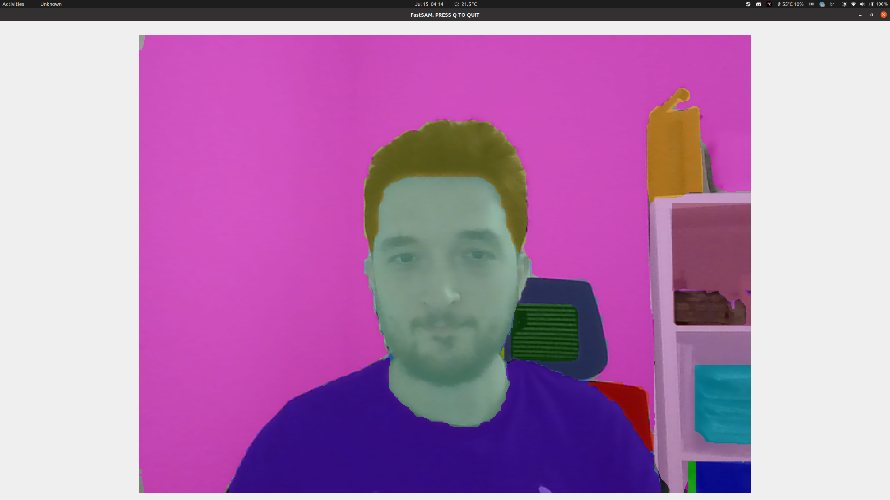

# FastSAM_webcam



**Note:** Code sometimes fails with error. Test with newer versions.

```
Traceback (most recent call last):
  File "FastSAM_webcam.py", line 56, in <module>
    results = model(frame,
  File "/home/salih/.local/lib/python3.8/site-packages/ultralytics/yolo/fastsam/model.py", line 106, in __call__
    return self.predict(source, stream, **kwargs)
  File "/home/salih/.local/lib/python3.8/site-packages/torch/utils/_contextlib.py", line 115, in decorate_context
    return func(*args, **kwargs)
  File "/home/salih/.local/lib/python3.8/site-packages/ultralytics/yolo/fastsam/model.py", line 58, in predict
    return self.predictor(source, stream=stream)
  File "/home/salih/.local/lib/python3.8/site-packages/ultralytics/yolo/engine/predictor.py", line 195, in __call__
    return list(self.stream_inference(source, model, *args, **kwargs))  # merge list of Result into one
  File "/home/salih/.local/lib/python3.8/site-packages/torch/utils/_contextlib.py", line 35, in generator_context
    response = gen.send(None)
  File "/home/salih/.local/lib/python3.8/site-packages/ultralytics/yolo/engine/predictor.py", line 255, in stream_inference
    self.results = self.postprocess(preds, im, im0s)
  File "/home/salih/.local/lib/python3.8/site-packages/ultralytics/yolo/fastsam/predict.py", line 31, in postprocess
    full_box[0][4] = p[0][critical_iou_index][:, 4]
RuntimeError: expand(torch.cuda.FloatTensor{[2]}, size=[]): the number of sizes provided (0) must be greater or equal to the number of dimensions in the tensor (1)
```

